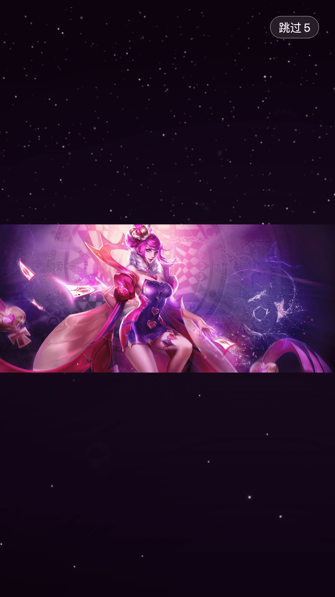
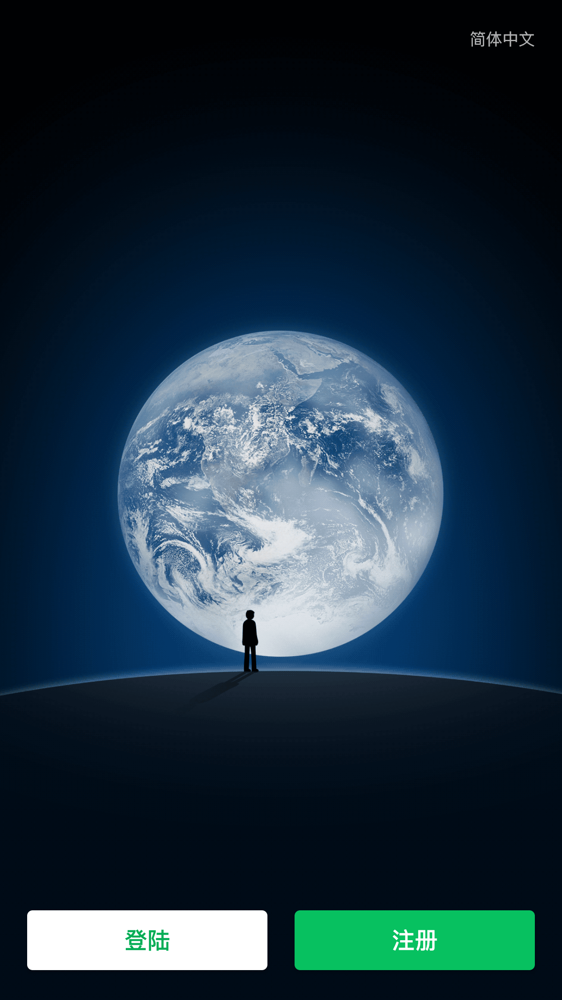
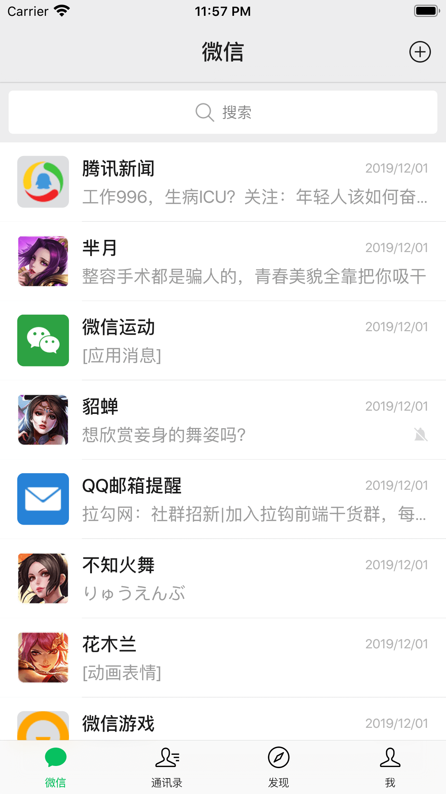
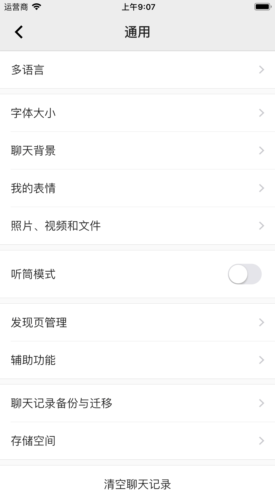

# WeChat_Resource

### 一、概述

### 预览

###### 闪屏模块

|  |  |  |
| :---------------------------------------: | :---------------------------------------: | :---------------------------------------: |

###### 登陆/注册模块

|        |       |      |
| :-----------------------------------------: | :-------------------------------------------: | :---------------------------------------------: |
|  |  |  |

###### 微信模块

|  | 虚位以待 | 虚位以待 |
| :---------------------------------------------: | :------: | :------: |

###### 通讯录模块

|  |  |  |
| :-------------------------------------------: | :-------------------------------------------: | :-------------------------------------------: |

###### 发现模块

|  | 虚位以待 | 虚位以待 |
| :-------------------------------------------: | :------: | :------: |

###### 我模块

|  |  |  |
| :-----------------------------------------: | :-----------------------------------------: | :-----------------------------------------: |

###### 设置模块

|   |  |  |
| :----------------------------------------: | :------------------------------------------------: | :----------------------------------------------: |
|  |           |    |
